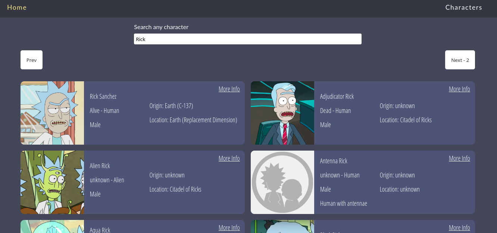

# Archived

This was made some time ago, I'm not gonna update but also I'm not gonna delete it, so I decided to archive

### React application build for learning purposes. Some features below:

- Redux-saga to handle async requests;
- React-route to handle navigation;
- SASS for styling

### Preview
  
  

###### Link for the [API](http://rickandmortyapi.com/) I'm using
